# Installation macOS

Installing two main things:

* **PostgreSQL**
  * PostgreSQL is the actual SQL engine that stores the data, has the database, reads in queries and returns back information from that database.
* **Pg admin** 
  * Pg Admin is the graphical user interface that we will use in order to connect with the back end of PostgreSQL.

## 1. Go to PostgreSQL website

[https://www.postgresql.org/download/](https://www.postgresql.org/download/)

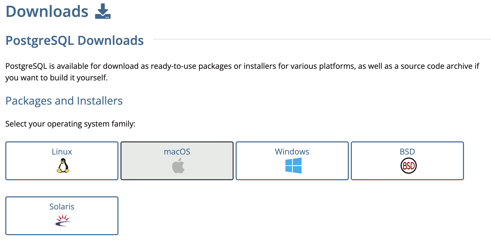

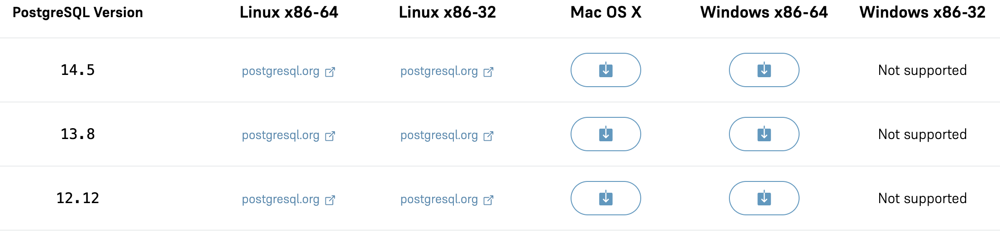

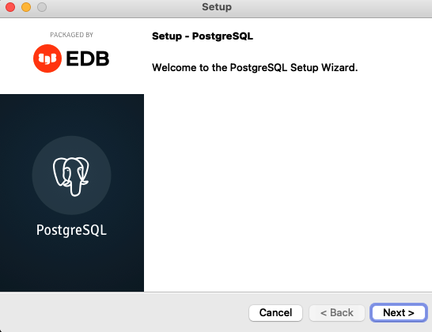

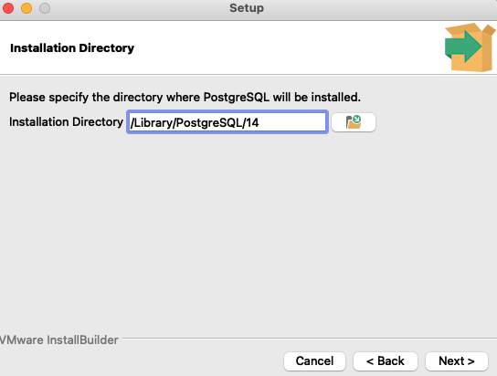

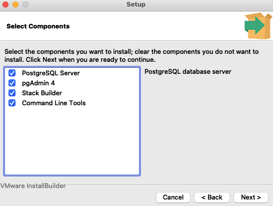

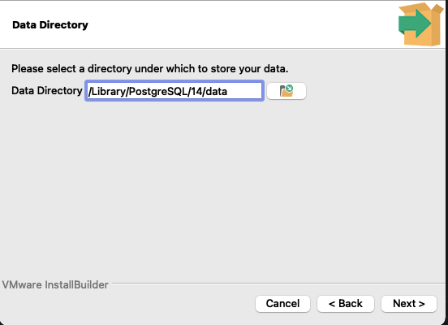

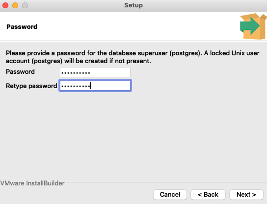

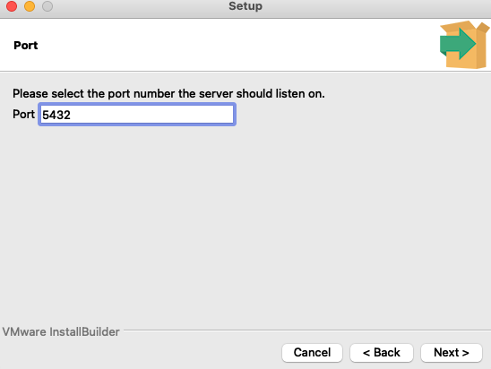

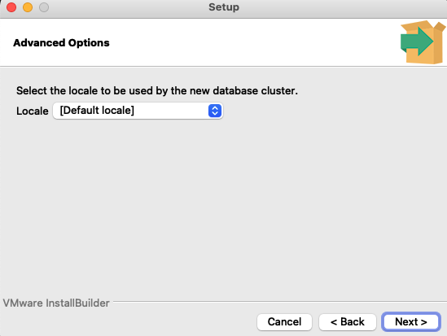

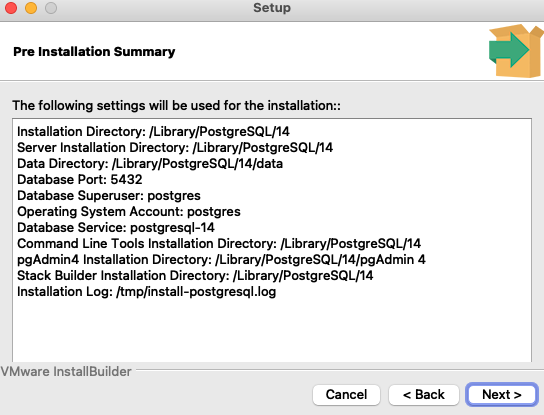

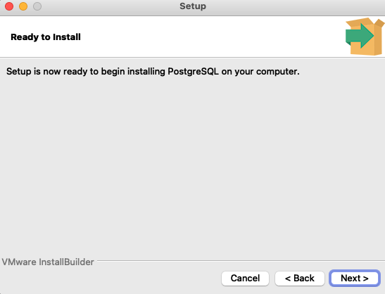

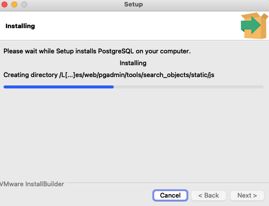

### 2. Pg Admin

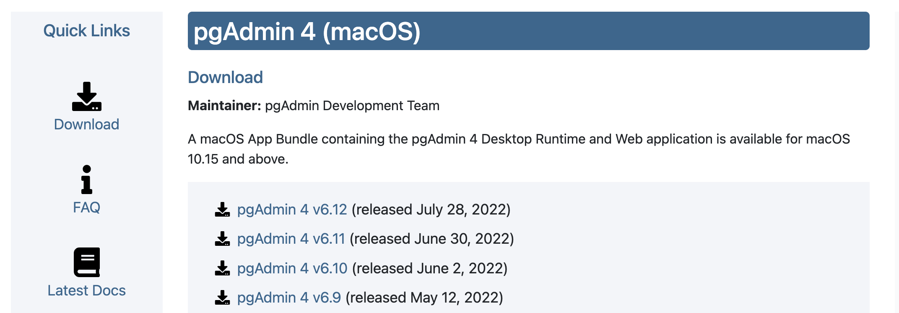

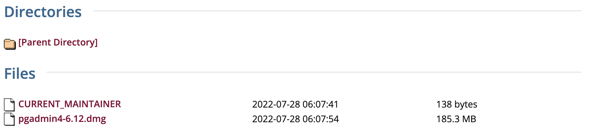

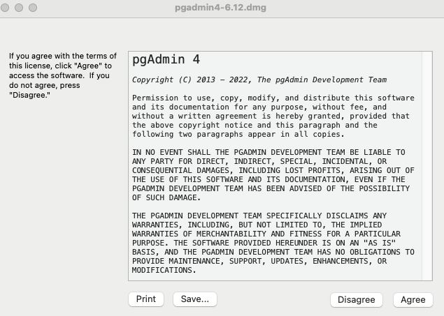

### 3. Downlaod the DVDrental

https://drive.google.com/file/d/1oBxiJkST9-7IjOMY-8aMXEMbrL6XcX49/view?usp=sharing

### 4. Reboot computer 

### 5. Create database and restore the file

Create new database and restore the dvdrental file. Make sure to enabled these three options.

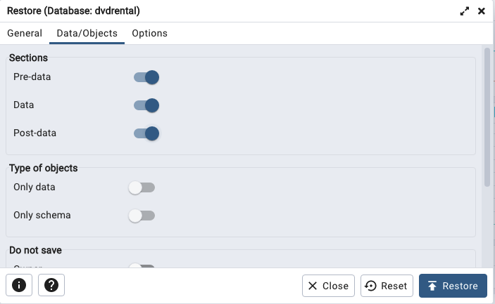

